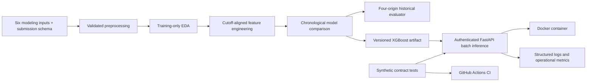

# Retail Sales Forecasting & Planning System

An AI/ML engineering system for 16-day retail sales forecasts at the
store-and-product-family level.

[](https://www.python.org/)
[](https://xgboost.readthedocs.io/)
[](https://fastapi.tiangolo.com/)
[](https://www.docker.com/)
[](https://github.com/mthufailsamas/retail-sales-forecasting-ai-engineering/actions/workflows/contract-tests.yml)
[](LICENSE)

This project forecasts 16 days of sales for every store and product family in
Corporacion Favorita's grocery data. The output gives planning teams one
consistent view of expected category demand before the next cycle begins.

## At a glance

| | Summary |
|---|---|
| **Problem** | One overall average cannot represent demand across 54 stores, 33 product families, promotions, holidays, and local operating conditions. |
| **Solution** | A multi-source feature pipeline compares Ridge and XGBoost chronologically, then packages the selected model for batch and API inference. |
| **Verified result** | The system generated 28,512 store-family forecasts with 15.6431% internal-test WAPE and 0.7623% signed bias; all 63 core contract tests passed locally and in GitHub Actions, and local API and Docker predictions matched the notebook batch exactly. |

Demand moves differently across stores, product families, promotions, weekly
patterns, and local events. The system handles that variation at the
`date x store_nbr x family` level and produces 28,512 planning-ready forecasts
per run.

## System workflow



## Verified results

The executed local workflow processed 3,000,888 labeled rows and 28,512 Kaggle
inference rows across 54 stores, 33 product families, and 1,782 store-family
series. It applied the same 16-day information cutoff to sales, transactions,
and oil, then evaluated three Ridge and 27 XGBoost configurations on the fixed
validation window.

| Evidence | Result |
|---|---:|
| Best validation method | XGBoost Regression |
| Selected parameters | `learning_rate=0.05`, `max_depth=8`, `n_estimators=500` |
| Validation RMSLE | 0.4131 |
| Validation WAPE | 13.5188% |
| Internal-test RMSLE | 0.4140 |
| Internal-test WAPE | 15.6431% |
| Internal-test signed bias | 0.7623% |
| Kaggle inference rows written | 28,512 |
| Core automated contract tests | 63/63 passed locally and in GitHub Actions |
| Optional interview-demo checks | 5/5 passed locally |
| API batch verification | 28,512/28,512 predictions matched |
| Local Docker verification | Healthy; 28,512/28,512 predictions matched |
| GitHub Actions CI | Python contracts and non-root container readiness |

The selected pipeline was serialized, reloaded in a fresh process, and used to
generate the full 28,512-row batch. The same artifact ran through FastAPI and a
healthy Docker container, with every prediction matching the notebook batch.

Error analysis breaks the internal test down by forecast day, store, product
family, promotion, and holiday status while leaving the selected model frozen.

## Technology stack

| Responsibility | Tools |
|---|---|
| Data preparation and analysis | pandas, NumPy, Jupyter |
| Modeling and evaluation | scikit-learn, XGBoost |
| Inference service | FastAPI, API-key security, structured JSON logs and metrics |
| Software verification | unittest, HTTPX, synthetic contract data |
| Packaging and delivery | Docker, GitHub Actions |

## Data

The source is Kaggle's
[Store Sales - Time Series Forecasting](https://www.kaggle.com/competitions/store-sales-time-series-forecasting)
competition.

| Source table | Role in the project |
|---|---|
| `train.csv` | labeled date-store-family sales history |
| `test.csv` | 16 future dates and forecast-known row identity |
| `stores.csv` | store location, type, and cluster metadata |
| `oil.csv` | historical oil values used only through safe lags |
| `transactions.csv` | historical store activity used only through safe lags |
| `holidays_events.csv` | forecast-known holiday and planned-event context |
| `sample_submission.csv` | output identity and ordering check |

- **Target:** recorded `sales`.
- **Prediction grain:** one future `date x store_nbr x family` row.
- **Forecast horizon:** 16 consecutive calendar days.
- **History:** 2013-2017.
- **Product level:** `family` category.

The model uses planned promotions, store metadata, forecast-known calendar and
operating-status fields, one planned-event signal, last-known historical oil
with source age, exact historical transactions, and past sales. Calendar input
is limited to month, day of month, and day of week, with Monday represented by
1 and Sunday by 7. The four historical lags are 16, 21, 28, and 35 days.
`sample_submission.csv` validates output identity and order; it is not a
predictor. The Manabi earthquake sequence and target-period actual oil are
excluded to keep the feature contract credible outside the competition.

Raw and processed competition rows remain private and are excluded from Git.
Authorized users must accept the Kaggle competition rules before downloading
the data.

## Evaluation design

| Split | Date range | Use |
|---|---|---|
| Train / EDA | 2013-01-01 to 2017-07-14 | target analysis, features, and model fitting |
| Validation | 2017-07-15 to 2017-07-30 | compare two ML methods |
| Internal test | 2017-07-31 to 2017-08-15 | one final local evaluation |
| Kaggle inference | 2017-08-16 to 2017-08-31 | generate predictions without local labels |

Target analysis uses train only. The earliest rows form a warm-up period until
35-day sales and oil history exists. Validation selects the Ridge or XGBoost
configuration before one evaluation on the later internal test.

## Project structure

```text
data/
|-- raw/                         Private Kaggle source CSVs
`-- processed/                   Private preprocessing outputs
01_STORE_SALES_PREPROCESSING.ipynb
02_STORE_SALES_EDA.ipynb
03_STORE_SALES_MODELING.ipynb     Features, model evaluation, and error diagnostics
app.py                            Local health, metrics, and 16-day forecast API
demo.html                         Optional local interview dashboard
Dockerfile                        Reproducible local API image
.dockerignore                     Build-context and private-file exclusions
.github/workflows/contract-tests.yml
                                  Private-data-free CI contract tests
store_sales_preprocessing.py    Reusable raw-to-processed logic
store_sales_model.py             Model artifact and 16-day batch inference
evaluate_store_sales.py          Fixed four-origin historical evaluator
test_store_sales_model.py        Synthetic automated contract tests
test_evaluate_store_sales.py     Historical-evaluation contract tests
verify_api.py                    Live full-batch API verification client
demo.ps1                        Optional one-command interview demo
requirements.txt                 Development and verification dependencies
requirements-runtime.txt         Minimal API and model-serving dependencies
constraints.txt                  Shared resolved dependency constraints
LICENSE                          MIT terms for original code and documentation
```

The notebooks retain their code and engineering notes while leaving generated
outputs out of version control. Running them in order rebuilds the processed
tables, plots, metrics, model artifact, and forecast files.

## Optional interview demo

This role-based local workspace supports interviews and repository reviews
without changing the V1 model, forecast contract, artifact, metrics, or core
engineering evidence.

After the local environment, private artifact, compact runtime history, and
Docker image have been prepared once, the complete demonstration starts with
one PowerShell command:

```powershell
& ".\demo.ps1"
```

The launcher creates a temporary API key, restarts the named local container,
waits for Docker readiness, runs the complete 28,512-row HTTP verification,
records notebook-batch parity for that exact response, and opens one local
operational dashboard. The default Planning Workspace lets a demand planner
filter the verified model output by store and product family, review the
16-day curve and row-level forecast, and download the selected planning slice
as CSV. The AI Engineering Operations workspace presents the loaded artifact,
contract checks, latency, rejections, and model-error counters in a separate
role view.

The accepted model stays frozen. Private source data and artifacts remain on
read-only mounts, and the temporary key is removed from the launching
PowerShell environment after setup. If startup or verification fails, the
launcher removes the incomplete demo container.

The interview-only `/demo`, `/demo/summary`, `/demo/planning`,
`/demo/planning.csv`, and `/demo/verification` routes are disabled by default
and excluded from OpenAPI. The documented forecast API contract remains
focused on health, forecasting, and operational metrics.

Use the rebuild option only after Docker-facing source or dependencies change:

```powershell
& ".\demo.ps1" -Rebuild
```

Stop the local demo when the interview or review is finished:

```powershell
docker stop retail-sales-forecast-api
```

## Local setup

From Windows PowerShell in this project directory:

```powershell
python -m venv .venv
```

```powershell
.\.venv\Scripts\python.exe -m pip install -r requirements.txt
```

`requirements.txt` installs the notebook, data, test, and verification tools.
It reuses the smaller `requirements-runtime.txt` service environment, while
`constraints.txt` constrains the resolved versions shared by both installations.

```powershell
& ".\.venv\Scripts\python.exe" -m kaggle auth login
```

Select `.\.venv\Scripts\python.exe` as the Jupyter kernel for all three
notebooks so the interactive environment uses the installed project
dependencies.

After accepting the competition rules, download and extract the source:

```powershell
& ".\.venv\Scripts\python.exe" -m kaggle competitions download -c store-sales-time-series-forecasting -p data\raw
```

```powershell
Expand-Archive -LiteralPath "data\raw\store-sales-time-series-forecasting.zip" -DestinationPath "data\raw" -Force
```

```powershell
Remove-Item -LiteralPath "data\raw\store-sales-time-series-forecasting.zip"
```

Open the notebooks from the project root and run them in this order:

1. `01_STORE_SALES_PREPROCESSING.ipynb`
2. `02_STORE_SALES_EDA.ipynb`
3. `03_STORE_SALES_MODELING.ipynb`

Notebook 01 inspects all seven competition files, preprocesses the six modeling
inputs, and reserves `sample_submission.csv` for the final output-order check.
It performs and validates every accepted join and feature transformation before
replacing the two processed CSVs. Notebook 02 checks the exact 34-column header
before EDA. Notebook 03 checks both processed headers before feature engineering
or model fitting. These checks prevent an older generated file from silently
entering a later stage.

For a batch-only rebuild outside Jupyter, the same reusable preprocessing logic
can be run with:

```powershell
.\.venv\Scripts\python.exe store_sales_preprocessing.py --overwrite
```

The modeling notebook evaluates three Ridge settings and 27 XGBoost settings
on the fixed validation window. It intentionally avoids ordinary K-Fold because
the experiment must preserve chronological order. The final section saves and
reloads the selected processor and model before writing both a planning-friendly
batch forecast and the Kaggle submission. This stage can take substantial time
on local hardware.

After notebook 03 creates the private artifact, verify inference from a fresh
process:

```powershell
.\.venv\Scripts\python.exe store_sales_model.py --overwrite
```

The command validates that the history ends at the artifact cutoff, the future
batch contains exactly the next 16 dates, every store-family pair is complete,
calendar values match the dates, and all predictions are finite and
non-negative. Generated artifacts and row-level forecasts remain excluded from
Git.

### Historical evaluation

The fixed `retail-history-eval-01` evaluator refits the unchanged V1
configuration at 4 predeclared forecast origins and compares it with a weekly
seasonal-naive reference. Each forecast is generated before scoring actuals are
attached. The resulting private bundle contains identified row-level
predictions, per-window and aggregate metrics, segment diagnostics, input and
code fingerprints, resolved model configuration, and runtime provenance.

The windows follow a target-free scenario design. Complete 16-day candidates
are ranked using only date coverage, known promotion exposure and intensity,
and scheduled calendar context. Sales and model errors do not participate in
their selection.

| Window | Evaluation role | Forecast origin | Scoring dates |
|---|---|---|---|
| W1 | Typical operating context | 2016-08-25 | 2016-08-26 to 2016-09-10 |
| W2 | Planned-event and promotion stress | 2016-11-24 | 2016-11-25 to 2016-12-10 |
| W3 | Holiday stress | 2017-02-15 | 2017-02-16 to 2017-03-03 |
| W4 | Most recent complete pre-validation period | 2017-06-28 | 2017-06-29 to 2017-07-14 |

This preserves the equal forecast duration and expanding training history used
in [time-series cross-validation](https://scikit-learn.org/stable/modules/generated/sklearn.model_selection.TimeSeriesSplit.html),
while adding explicit operating scenarios to the fixed rolling-origin design.

Run the material evaluation once from the project environment:

```powershell
& ".\.venv\Scripts\python.exe" evaluate_store_sales.py
```

The output is written atomically under
`artifacts/evaluation/retail-history-eval-01-v1/` and remains excluded from Git.
Its aggregate RMSLE gives every 16-day window equal weight, while aggregate
WAPE and bias use pooled sales and errors. Zero-actual slices preserve
undefined percentage metrics as unavailable values.

Prepare the private deployment-only history without retraining or retuning:

```powershell
& ".\.venv\Scripts\python.exe" store_sales_model.py --prepare-deployment-history --overwrite
```

The verified export contains only the four runtime fields required for sales
lags across the final 35 history days. It reduced the serving history from the
438.84-MiB complete labeled table to a 0.297-MiB private compressed file while
preserving the artifact cutoff and key checks. Both files remain excluded from
Git and the Docker image.

Run the lightweight software-contract checks separately:

```powershell
& ".\.venv\Scripts\python.exe" -m unittest -v test_store_sales_model.py test_evaluate_store_sales.py
```

The tests use synthetic tables and do not read private competition rows, fit a
model, or rerun hyperparameter tuning. They verify preprocessing semantics,
valid inference, and rejection of malformed source events, horizons, keys,
coverage, artifacts, and outputs.

After the 63 core contracts and 5 optional demo checks pass, create a local key
with at least 32 characters. Keep
the value outside source code, shell commands, Docker images, and Git:

```powershell
$env:RETAIL_FORECAST_API_KEY = Read-Host "Enter a local API key with at least 32 characters" -MaskInput
```

Then start the local API from that terminal:

```powershell
& ".\.venv\Scripts\python.exe" -m uvicorn app:app --host 127.0.0.1 --port 8000 --no-access-log
```

The interactive API contract is available at
`http://127.0.0.1:8000/docs`. `GET /health` loads the trusted artifact and its
compact 35-day sales context before reporting ready. `GET /metrics` reports
bounded process-local operational counters. `POST /forecast` accepts one
complete 16-day processed future batch and returns one prediction for every
input row. `/forecast` and `/metrics` require `X-API-Key`; `/health` remains a
public readiness endpoint but reports ready only when authentication and model
runtime configuration are both available.

With Uvicorn still running, open a second PowerShell terminal in the project
directory and verify the complete private batch through HTTP:

```powershell
$env:RETAIL_FORECAST_API_KEY = Read-Host "Enter the same local API key" -MaskInput
```

```powershell
& ".\.venv\Scripts\python.exe" verify_api.py
```

The client verifies health, sends all 28,512 processed future rows to
`POST /forecast`, checks the response contract, and compares every returned
prediction with the notebook batch.
It then sends one incomplete batch and one schema-invalid record, confirms both
are rejected, confirms that a missing API key returns HTTP 401, and checks that
`/metrics` separates all three outcomes. The key is read from the environment
and is not accepted as a command-line argument.

## API authentication

`POST /forecast` and `GET /metrics` require the `X-API-Key` header. The service
reads the expected value only from `RETAIL_FORECAST_API_KEY`, requires at least
32 characters, and uses a constant-time comparison. Missing or incorrect
client credentials return HTTP 401; missing server configuration returns HTTP
503. Request logs and monitoring counters do not retain the supplied key.

## Docker

The API uses the constrained runtime-only environment inside a local container.
Notebook, Kaggle, plotting, and HTTP test-client packages stay outside the
runtime image. The runtime stage executes as the unprivileged `retail` user,
and the private artifact and processed history are not copied into the image.
Stop the standalone Uvicorn process first so port 8000 is available, then build
the image:

```powershell
docker build --tag retail-sales-forecast-api:v1 .
```

From the project root, generate a process-local key without printing it, then
capture the project path:

```powershell
$env:RETAIL_FORECAST_API_KEY = & ".\.venv\Scripts\python.exe" -c "import secrets; print(secrets.token_urlsafe(32))"
```

```powershell
$projectPath = (Get-Location).Path
```

Start the container with the compact private runtime directory mounted
read-only. The two path variables keep the private runtime boundary portable
without embedding the model or its history in the image:

```powershell
docker run --rm --detach --name retail-sales-forecast-api --publish 127.0.0.1:8000:8000 --env RETAIL_FORECAST_API_KEY --env RETAIL_FORECAST_ARTIFACT_PATH=/app/private/store_sales_forecast_v1.pkl --env RETAIL_FORECAST_HISTORY_PATH=/app/private/store_sales_forecast_v1_history.csv.gz --mount "type=bind,source=$projectPath\artifacts,target=/app/private,readonly" retail-sales-forecast-api:v1
```

From the same terminal, check the Docker health status and run the same
full-batch verification used for the local API:

```powershell
docker inspect --format "{{.State.Health.Status}}" retail-sales-forecast-api
```

```powershell
& ".\.venv\Scripts\python.exe" verify_api.py
```

The verified container returned all 28,512 predictions with exact notebook
parity and recorded successful, contract-rejected, schema-rejected, and
authentication-rejected outcomes. Its runtime used the versioned artifact and
the 0.297-MiB compact history mounted read-only under `/app/private`.

## Structured logging

The API writes one JSON record for every request with a UTC timestamp, generated
request ID, HTTP method, endpoint path, response status, latency in milliseconds,
and forecast row count. The same request ID is returned through the
`X-Request-ID` response header.

The container verification recorded a 200 response for all 28,512 forecast
rows in 2,181.268 milliseconds. Request rows, product families, predictions,
credentials, artifact contents, and local paths are excluded from the logs.
Uvicorn's duplicate access log is disabled in the documented commands.

## Operational monitoring

`GET /metrics` exposes aggregate API reliability and input-contract evidence
without retaining request rows or predictions. It reports request and response
counts, latency summaries by endpoint, forecast rows received, successful
batches, schema rejections, contract rejections, unavailable runtime responses,
authentication rejections, and model errors.

The verified container run recorded one successful 28,512-row batch, one
schema rejection, one batch-contract rejection, one authentication rejection,
and zero runtime or model errors.

## Continuous integration

The GitHub Actions workflow installs Python 3.12.10 with the constrained
development environment, runs 63 core contracts plus 5 optional interview-demo
checks, builds the final runtime image, verifies its non-root user and reduced
dependency boundary, and starts a private-data-free synthetic runtime until the
container reports ready. The CI-only stage is separate from the final runtime
image and does not contain competition data or the fitted retail artifact.

## Author

M. Thufail Alwannabil Samas

## License

Original code and documentation are available under the [MIT License](LICENSE).
The Kaggle competition data, generated model artifact, and private prediction
files are not distributed by this repository and remain subject to their
original terms.
