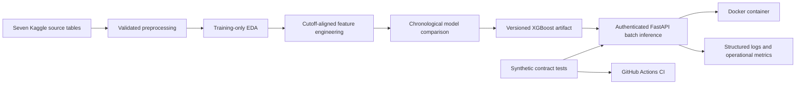

# Retail Sales Forecasting & Planning System

An AI/ML engineering system for 16-day retail sales forecasts at the
store-and-product-family level.

[](https://www.python.org/)
[](https://xgboost.readthedocs.io/)
[](https://fastapi.tiangolo.com/)
[](https://www.docker.com/)
[](https://github.com/mthufailsamas/retail-sales-forecasting-ai-engineering/actions/workflows/contract-tests.yml)
[](LICENSE)

This project forecasts 16 days of sales for every store and product family in
Corporacion Favorita's grocery data. The output gives planning teams one
consistent view of expected category demand before the next cycle begins.

## At a glance

| | Summary |
|---|---|
| **Problem** | One overall average cannot represent demand across 54 stores, 33 product families, promotions, holidays, and local operating conditions. |
| **Solution** | A seven-source feature pipeline compares Ridge and XGBoost chronologically, then packages the selected model for batch and API inference. |
| **Verified result** | The system generated 28,512 store-family forecasts with 15.6431% internal-test WAPE and 0.7623% signed bias; all 38 contract tests passed, and local API and Docker predictions matched the notebook batch exactly. |

Demand moves differently across stores, product families, promotions, weekly
patterns, and local events. The system handles that variation at the
`date x store_nbr x family` level and produces 28,512 planning-ready forecasts
per run.

## System workflow



## Verified results

The executed local workflow processed 3,000,888 labeled rows and 28,512 Kaggle
inference rows across 54 stores, 33 product families, and 1,782 store-family
series. It applied the same 16-day information cutoff to sales, transactions,
and oil, then evaluated three Ridge and 27 XGBoost configurations on the fixed
validation window.

| Evidence | Result |
|---|---:|
| Best validation method | XGBoost Regression |
| Selected parameters | `learning_rate=0.05`, `max_depth=8`, `n_estimators=500` |
| Validation RMSLE | 0.4131 |
| Validation WAPE | 13.5188% |
| Internal-test RMSLE | 0.4140 |
| Internal-test WAPE | 15.6431% |
| Internal-test signed bias | 0.7623% |
| Kaggle inference rows written | 28,512 |
| Automated contract tests | 38/38 passed |
| API batch verification | 28,512/28,512 predictions matched |
| Local Docker verification | Healthy; 28,512/28,512 predictions matched |
| GitHub Actions CI | Passed on Python 3.12.10 |

The selected pipeline was serialized, reloaded in a fresh process, and used to
generate the full 28,512-row batch. The same artifact ran through FastAPI and a
healthy Docker container, with every prediction matching the notebook batch.

Error analysis breaks the internal test down by forecast day, store, product
family, promotion, and holiday status while leaving the selected model frozen.

## Technology stack

| Responsibility | Tools |
|---|---|
| Data preparation and analysis | pandas, NumPy, Jupyter |
| Modeling and evaluation | scikit-learn, XGBoost |
| Inference service | FastAPI, API-key security, structured JSON logs and metrics |
| Software verification | unittest, HTTPX, synthetic contract data |
| Packaging and delivery | Docker, GitHub Actions |

## Data

The source is Kaggle's
[Store Sales - Time Series Forecasting](https://www.kaggle.com/competitions/store-sales-time-series-forecasting)
competition.

| Source table | Role in the project |
|---|---|
| `train.csv` | labeled date-store-family sales history |
| `test.csv` | 16 future dates and forecast-known row identity |
| `stores.csv` | store location, type, and cluster metadata |
| `oil.csv` | historical oil values used only through safe lags |
| `transactions.csv` | historical store activity used only through safe lags |
| `holidays_events.csv` | forecast-known holiday and planned-event context |
| `sample_submission.csv` | output identity and ordering check |

- **Target:** recorded `sales`.
- **Prediction grain:** one future `date x store_nbr x family` row.
- **Forecast horizon:** 16 consecutive calendar days.
- **History:** 2013-2017.
- **Product level:** `family` category.

The model uses planned promotions, store metadata, forecast-known calendar and
operating-status fields, one planned-event signal, last-known historical oil
with source age, exact historical transactions, and past sales. Calendar input
is limited to month, day of month, and day of week, with Monday represented by
1 and Sunday by 7. The four historical lags are 16, 21, 28, and 35 days.
`sample_submission.csv` validates output identity and order; it is not a
predictor. The Manabi earthquake sequence and target-period actual oil are
excluded to keep the feature contract credible outside the competition.

Raw and processed competition rows remain private and are excluded from Git.
Authorized users must accept the Kaggle competition rules before downloading
the data.

## Evaluation design

| Split | Date range | Use |
|---|---|---|
| Train / EDA | 2013-01-01 to 2017-07-14 | target analysis, features, and model fitting |
| Validation | 2017-07-15 to 2017-07-30 | compare two ML methods |
| Internal test | 2017-07-31 to 2017-08-15 | one final local evaluation |
| Kaggle inference | 2017-08-16 to 2017-08-31 | generate predictions without local labels |

Target analysis uses train only. The earliest rows form a warm-up period until
35-day sales and oil history exists. Validation selects the Ridge or XGBoost
configuration before one evaluation on the later internal test.

## Project structure

```text
data/
|-- raw/                         Private Kaggle source CSVs
`-- processed/                   Private preprocessing outputs
01_STORE_SALES_PREPROCESSING.ipynb
02_STORE_SALES_EDA.ipynb
03_STORE_SALES_MODELING.ipynb     Features, model evaluation, and error diagnostics
app.py                            Local health, metrics, and 16-day forecast API
Dockerfile                        Reproducible local API image
.dockerignore                     Build-context and private-file exclusions
.github/workflows/contract-tests.yml
                                  Private-data-free CI contract tests
store_sales_preprocessing.py    Reusable raw-to-processed logic
store_sales_model.py             Model artifact and 16-day batch inference
test_store_sales_model.py        Synthetic automated contract tests
verify_api.py                    Live full-batch API verification client
requirements.txt                 Current Python dependencies
LICENSE                          MIT terms for original code and documentation
```

The notebooks retain their code and engineering notes while leaving generated
outputs out of version control. Running them in order rebuilds the processed
tables, plots, metrics, model artifact, and forecast files.

## Local setup

From Windows PowerShell in this project directory:

```powershell
python -m venv .venv
.\.venv\Scripts\python.exe -m pip install -r requirements.txt
& ".\.venv\Scripts\python.exe" -m kaggle auth login
```

Select `.\.venv\Scripts\python.exe` as the Jupyter kernel for all three
notebooks so the interactive environment uses the installed project
dependencies.

After accepting the competition rules, download and extract the source:

```powershell
& ".\.venv\Scripts\python.exe" -m kaggle competitions download `
  -c store-sales-time-series-forecasting `
  -p data\raw

Expand-Archive `
  -LiteralPath "data\raw\store-sales-time-series-forecasting.zip" `
  -DestinationPath "data\raw" `
  -Force

Remove-Item -LiteralPath "data\raw\store-sales-time-series-forecasting.zip"
```

Open the notebooks from the project root and run them in this order:

1. `01_STORE_SALES_PREPROCESSING.ipynb`
2. `02_STORE_SALES_EDA.ipynb`
3. `03_STORE_SALES_MODELING.ipynb`

Notebook 01 reads the seven raw CSVs, performs and validates every accepted
join and feature transformation, then replaces the two processed CSVs. Notebook
02 checks the exact 34-column header before EDA. Notebook 03 checks both
processed headers before feature engineering or model fitting. These checks
prevent an older generated file from silently entering a later stage.

For a batch-only rebuild outside Jupyter, the same reusable preprocessing logic
can be run with:

```powershell
.\.venv\Scripts\python.exe store_sales_preprocessing.py --overwrite
```

The modeling notebook evaluates three Ridge settings and 27 XGBoost settings
on the fixed validation window. It intentionally avoids ordinary K-Fold because
the experiment must preserve chronological order. The final section saves and
reloads the selected processor and model before writing both a planning-friendly
batch forecast and the Kaggle submission. This stage can take substantial time
on local hardware.

After notebook 03 creates the private artifact, verify inference from a fresh
process:

```powershell
.\.venv\Scripts\python.exe store_sales_model.py --overwrite
```

The command validates that the history ends at the artifact cutoff, the future
batch contains exactly the next 16 dates, every store-family pair is complete,
calendar values match the dates, and all predictions are finite and
non-negative. Generated artifacts and row-level forecasts remain excluded from
Git.

Prepare the private deployment-only history without retraining or retuning:

```powershell
& ".\.venv\Scripts\python.exe" store_sales_model.py --prepare-deployment-history --overwrite
```

The verified export contains only the four runtime fields required for sales
lags across the final 35 history days. It reduced the serving history from the
438.84-MiB complete labeled table to a 0.297-MiB private compressed file while
preserving the artifact cutoff and key checks. Both files remain excluded from
Git and the Docker image.

Run the lightweight software-contract checks separately:

```powershell
& ".\.venv\Scripts\python.exe" -m unittest -v test_store_sales_model.py
```

The tests use synthetic tables and do not read private competition rows, fit a
model, or rerun hyperparameter tuning. They verify both valid inference and
rejection of malformed horizons, keys, coverage, artifact environments, and
outputs.

After all 38 tests pass, create a local key with at least 32 characters. Keep
the value outside source code, shell commands, Docker images, and Git:

```powershell
$env:RETAIL_FORECAST_API_KEY = Read-Host `
  "Enter a local API key with at least 32 characters" `
  -MaskInput
```

Then start the local API from that terminal:

```powershell
& ".\.venv\Scripts\python.exe" -m uvicorn app:app `
  --host 127.0.0.1 `
  --port 8000 `
  --no-access-log
```

The interactive API contract is available at
`http://127.0.0.1:8000/docs`. `GET /health` loads the trusted artifact and its
compact 35-day sales context before reporting ready. `GET /metrics` reports
bounded process-local operational counters. `POST /forecast` accepts one
complete 16-day processed future batch and returns one prediction for every
input row. `/forecast` and `/metrics` require `X-API-Key`; `/health` remains a
public readiness endpoint but reports ready only when authentication and model
runtime configuration are both available.

With Uvicorn still running, open a second PowerShell terminal in the project
directory and verify the complete private batch through HTTP:

```powershell
$env:RETAIL_FORECAST_API_KEY = Read-Host `
  "Enter the same local API key" `
  -MaskInput

& ".\.venv\Scripts\python.exe" verify_api.py
```

The client verifies health, sends all 28,512 processed future rows to
`POST /forecast`, checks the response contract, and compares every returned
prediction with the notebook batch.
It then sends one incomplete batch and one schema-invalid record, confirms both
are rejected, confirms that a missing API key returns HTTP 401, and checks that
`/metrics` separates all three outcomes. The key is read from the environment
and is not accepted as a command-line argument.

## API authentication

`POST /forecast` and `GET /metrics` require the `X-API-Key` header. The service
reads the expected value only from `RETAIL_FORECAST_API_KEY`, requires at least
32 characters, and uses a constant-time comparison. Missing or incorrect
client credentials return HTTP 401; missing server configuration returns HTTP
503. Request logs and monitoring counters do not retain the supplied key.

## Docker

The API can use the same pinned environment inside a local container. The
private artifact and processed history are not copied into the image. Stop the
standalone Uvicorn process first so port 8000 is available, then build the image:

```powershell
docker build --tag retail-sales-forecast-api:v1 .
```

From the project root, generate a process-local key without printing it, then
capture the project path:

```powershell
$env:RETAIL_FORECAST_API_KEY = & ".\.venv\Scripts\python.exe" -c "import secrets; print(secrets.token_urlsafe(32))"
```

```powershell
$projectPath = (Get-Location).Path
```

Start the container with the compact private runtime directory mounted
read-only. The two path variables keep the private runtime boundary portable
without embedding the model or its history in the image:

```powershell
docker run --rm --detach --name retail-sales-forecast-api --publish 8000:8000 --env RETAIL_FORECAST_API_KEY --env RETAIL_FORECAST_ARTIFACT_PATH=/app/private/store_sales_forecast_v1.pkl --env RETAIL_FORECAST_HISTORY_PATH=/app/private/store_sales_forecast_v1_history.csv.gz --mount "type=bind,source=$projectPath\artifacts,target=/app/private,readonly" retail-sales-forecast-api:v1
```

From the same terminal, check the Docker health status and run the same
full-batch verification used for the local API:

```powershell
docker inspect --format "{{.State.Health.Status}}" retail-sales-forecast-api
```

```powershell
& ".\.venv\Scripts\python.exe" verify_api.py
```

The verified container returned all 28,512 predictions with exact notebook
parity and recorded successful, contract-rejected, schema-rejected, and
authentication-rejected outcomes. Its runtime used the versioned artifact and
the 0.297-MiB compact history mounted read-only under `/app/private`.

## Structured logging

The API writes one JSON record for every request with a UTC timestamp, generated
request ID, HTTP method, endpoint path, response status, latency in milliseconds,
and forecast row count. The same request ID is returned through the
`X-Request-ID` response header.

The container verification recorded a 200 response for all 28,512 forecast
rows in 2,181.268 milliseconds. Request rows, product families, predictions,
credentials, artifact contents, and local paths are excluded from the logs.
Uvicorn's duplicate access log is disabled in the documented commands.

## Operational monitoring

`GET /metrics` exposes aggregate API reliability and input-contract evidence
without retaining request rows or predictions. It reports request and response
counts, latency summaries by endpoint, forecast rows received, successful
batches, schema rejections, contract rejections, unavailable runtime responses,
authentication rejections, and model errors.

The verified container run recorded one successful 28,512-row batch, one
schema rejection, one batch-contract rejection, one authentication rejection,
and zero runtime or model errors.

## Continuous integration

The GitHub Actions workflow installs Python 3.12.10 and the pinned dependencies,
then runs all 38 synthetic contract tests on every push and pull request. Both
the `main` and `v1.0.0` release runs passed on the published root commit.

## Author

M. Thufail Alwannabil Samas

## License

Original code and documentation are available under the [MIT License](LICENSE).
The Kaggle competition data, generated model artifact, and private prediction
files are not distributed by this repository and remain subject to their
original terms.
